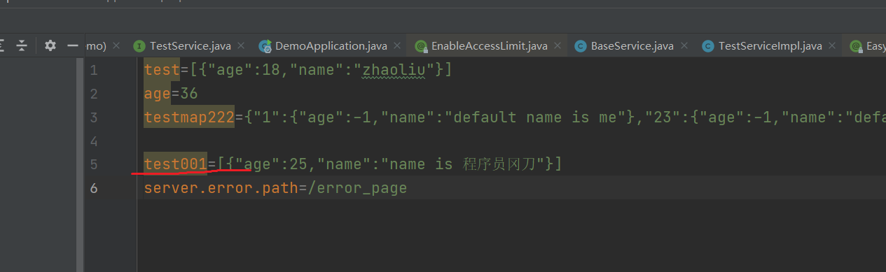

## 一、基于Spring动态配置：easy-config-spring 组件

### 1.1 背景

> 在基于spring项目启动后，项目中配置的参数值就不会发生变化了，如果用户想要修改项目中的配置值，还需要重新启动项目，才可以达到更新配置的目标。当前市面上也有很多动态配置的工具，但是大部分都是基于配置中心实现的。基于配置中心动态更新本地参数，过程十分的繁琐复杂。同时，这一个过程也涉及多个应用之间的关系，包含了其他的技术，例如：消息队列以及Redis或者zookeeper等等，实现配置中心以及从配置中心拉取数据。
>
> 基于配置中心动态更新应用中的配置，适用于规模比较大的服务，对于一般的小服务，就不需要这样复杂了。
>
> 基于此，本组件就是实现一个基于本地配置文件修改的动态配置。解决小项目，动态配置的需求。

### 1.2 核心功能

* `@Value`注解值动态更新
* 实现自定义注解`@EasyConfig`动态更新配置，并且支持`Map`、`List`等特殊参数类型配置。

## 二、如何使用

### 2.1 首先引入组件坐标

想要使用本组件，首先引入本项目的坐标到你的项目的pom.xml中：

```xml
        <dependency>
            <groupId>vip.breakpoint</groupId>
            <artifactId>easy-config-spring</artifactId>
            <version>xxxxx</version>
        </dependency>
```

!> 建议使用最新的版本!!!!

### 2.2 在启动类或者配置类上增加 `@EnableAutoConfig` 注解

`@EnableAutoConfig`的定义如下，它是开启功能的关键一个配置。另外，在这个注解中，还可以配置扫描项目外部文件的路径以及项目内部的文件的配置。

```java
/**
 * 启动自动更新的配置
 *
 * @author : breakpoint/赵先生
 * create on 2022/10/28
 * 欢迎关注公众号:代码废柴
 */
@Target(ElementType.TYPE)
@Retention(RetentionPolicy.RUNTIME)
@Documented
@Import({EnableAutoConfigBeanDefinitionRegistrar.class})
public @interface EnableAutoConfig {

    /**
     * 文件系统的监听路径
     *
     * @return 文件系统的监听
     */
    String[] fileSystemPaths() default {};

    /**
     * classpath 监听的文件
     * 用于启动后的配置
     * 打包后 jar 或者 war包里面的配置 有可能读取不到
     * 这个就是解决这个问题的 防止出现取不到值的问题
     */
    String[] classpathFiles() default {"classpath*:*.properties", "classpath*:*.yml", "classpath*:*.json"};
}

```

在启动类上增加这样的配置：

```java
@EnableAutoConfig
@SpringBootApplication
public class DemoApplication {

    public static void main(String[] args) {
        SpringApplication.run(DemoApplication.class, args);
    }

}
```

### 2.3 使用`@EasyConfig`获取动态配置值

```java
/**
 * @author : breakpoint/赵先生
 * create on 2022/10/29
 * 欢迎关注公众号:代码废柴
 */
@Lazy
@Service
public class TestServiceImpl extends BaseService implements TestService {

    @EasyConfig(value = "test001:[{\"age\":-1,\"name\":\"default name\"}]")
    private List<TestUser> list2;

    @Override
    public Object test() {
        return list2;
    }
}
```

?> `@EasyConfig`的配置是以`key:defaultValue`模式进行配置的。`@EasyConfig`注解支持增加在8大基本数据类型、String、List、Map上。

在application.properties中增加key值为test001的配置：



启动项目，即可自动配置数据类型值，并且，在项目运行的过程中，修改配置文件中的值，可以动态更新项目中的配置。

## 三、其他用法

### 3.1 不想动态更新怎么办？

如果不想动态更新配置，在使用`@EasyConfig`注解中，配置`isStatic = true`属性，表示这个配置不是随着配置的变化而变化的。

```java
@Lazy
@Service
public class TestServiceImpl extends BaseService implements TestService {

    @EasyConfig(value = "test001:[{\"age\":-1,\"name\":\"default name\"}]",isStatic = true)
    private List<TestUser> list2;

    @Override
    public Object test() {
        return list2;
    }
}
```

### 3.2 想要获取项目之外的配置文件

如果想获取项目之外的文件夹下的配置，可以使用如下配置：

```java
@EnableAutoConfig(fileSystemPaths = {"{\"C:\\\\work\\\\idea_work\"}"})
@SpringBootApplication
public class DemoApplication {

    public static void main(String[] args) {
        SpringApplication.run(DemoApplication.class, args);
    }

}
```

配置`@EnableAutoConfig(fileSystemPaths = {"{\"C:\\\\work\\\\idea_work\"}"})`时候，指明需要配置的文件路径。项目启动后，会自动的扫描该路径下的所有`*.properties`、`*.yml`、`*.json` 这三种配置文件内容。同时，该路径下的配置文件的修改也会动态刷新项目中的配置。


## 四、联系方式

🐘

<table>
  <tr>
    <td align="center">
      <a href="#">
        
      </a>
      <br />
      <span>微信</span>
    </td>
    <td align="center">
      <a href="#">
        
      </a>
      <br />
      <span>微信公众号</span>
    </td>
  </tr>
</table>

!> 以上就是 `easy-config-spring` 组件的全部功能，由于作者水平有限，肯定会存在需要歧义的地方，如果你有任何的疑问，都可以联系本作者。同时也欢迎关注《代码废柴》公众号。

**{docsify-updated}** 