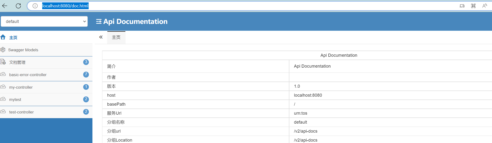
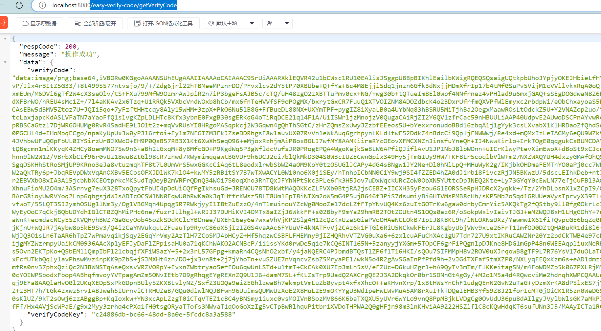
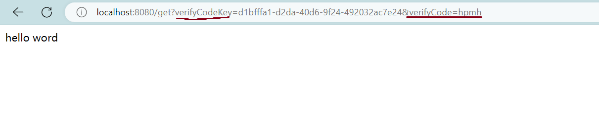

##  一、简单而又强大的访问控制组件：easy-access-authority

### 1.1 背景

> 在各种系统中，都充斥着各种各样权限问题。这个组件是一个制造的**轮子**，解决简单的权限访问问题。简单的引入和加上必要的注解，就可以实现对于用户的访问进行控制。同时，也加入了Swagger API文档的工具，配置扫描的路径，就可以针对配置的接口进行**自动生成接口文档**。

### 1.2 核心功能

1. 接口权限控制
2. 接口限流防刷
3. Swagger API工具

?> 后期规划功能：**校验验证码能力支持**

## 二、组件使用方法

?>  项目背景：新建spring-boot项目，jdk8以上，spring5.x

### 2.1 在pom.xml中引入坐标

```xml
<!-- https://mvnrepository.com/artifact/vip.breakpoint/easy-access-authority -->
<dependency>
    <groupId>vip.breakpoint</groupId>
    <artifactId>easy-access-authority</artifactId>
    <version>1.1.0</version>
</dependency>
```

### 2.2 启动类上加上注解

```java
@EnableAccessLimit
@SpringBootApplication
public class DemoApplication {

    public static void main(String[] args) {
        SpringApplication.run(DemoApplication.class, args);
    }

}
```

?> 如上所示，在spring-boot的启动类上加上`@EnableAccessLimit`注解。这样就可以开启`easy-access-authority`的权限控制的功能。

### 2.3 添加对应接口注解

```java
import org.springframework.web.bind.annotation.GetMapping;
import org.springframework.web.bind.annotation.RequestMapping;
import org.springframework.web.bind.annotation.RestController;
import vip.breakpoint.annotation.AccessLimit;

/**
 * @author : breakpoint/zlgtop@163.com
 * create on 2022/11/24
 * 欢迎关注公众号:代码废柴
 */
@RestController
@RequestMapping(value = "/")
public class MyController {

    @AccessLimit
    @GetMapping("/get")
    public Object get() {
        return "hello word";
    }
}
```

例如上面给出的接口代码：在对应的接口上加上`@AccessLimit`注解。就可以开启这个接口的访问控制功能。

如果，接口没有加上这个注解。默认是无法可以调用的，会返回下面的信息：

```json
{
    "code":700,
    "message":"操作失败",
    "data":"请在该接口方法上使用注解： @AccessLimit()"
}
```

## 三、访问控制的能力

> 访问控制的主要配置在@AccessLimit 注解中。不同的配置会实现不同的功能。

### 3.1 开启限流防刷功能

在对应的接口上，配置`enableClickLimit = true`的配置，就可以开启限流防刷功能。

```java
/**
 * @author : breakpoint/zlgtop@163.com
 * create on 2022/11/24
 * 欢迎关注公众号:代码废柴
 */
@RestController
@RequestMapping(value = "/")
public class MyController {

    @AccessLimit(enableClickLimit = true)
    @GetMapping("/get")
    public Object get() {
        return "hello word";
    }
}

```

如果点击频繁，就会返回下面的信息：

```json
{"code":600,"message":"操作失败","data":"操作过于频繁"}
```

### 3.2 开启登录功能

#### 3.2.1 关闭接口需要登录访问

?> 当前默认就是开启需要登录才可以访问接口。如果想不需要登录，就可以访问接口，那么可以进行如下配置：

```java
/**
 * @author : breakpoint/zlgtop@163.com
 * create on 2022/11/24
 * 欢迎关注公众号:代码废柴
 */
@RestController
@RequestMapping(value = "/")
public class MyController {

    @AccessLimit(enableClickLimit = true, isLogIn = false)
    @GetMapping("/get")
    public Object get() {
        return "hello word";
    }
}
```

这个配置`@AccessLimit(enableClickLimit = true, isLogIn = false)`就可以取消还接口需要登录。

?>  如果你想使用登录功能，需要按照下面的步骤来配置你的项目。

#### 3.2.2 开启登录功能操作步骤

* 配置接口

```java
@RestController
@RequestMapping(value = "/")
public class MyController {

    @AccessLimit(enableClickLimit = true, isLogIn = true)
    @GetMapping("/get")
    public Object get() {
        return "hello word";
    }
}
```

* 登录信息存入本地cache

?> 继承`UserStoreService`接口，并实现具体的接口中的方法，demo如下。

```java
/**
 * @author : breakpoint/zlgtop@163.com
 * create on 2022/11/24
 * 欢迎关注公众号:代码废柴
 */
@Service
public class MyUserStoreService implements UserStoreService {
    @Override
    public <T extends Serializable> boolean storeUserMessage(String userToken, T userMessage)
            throws EasyToolException {
        ...
        return true;
    }

    @Override
    public <T extends Serializable> T getUserMessageByUserToken(String userToken, Class<T> clazz)
            throws EasyToolException {
        ...
        return null;
    }

    @Override
    public Object getUserMessageByUserToken(String userToken) throws EasyToolException {
        ...
        return null;
    }
}
```

上面的`MyUserStoreService`是自定义的一个用户存储的bean，如果不定义，默认采用`DefaultUserStoreServiceImpl`实现用户的存储。

```java
public class DefaultUserStoreServiceImpl implements UserStoreService {

    @Override
    public <T extends Serializable> boolean storeUserMessage(String userToken, T userMessage) throws EasyToolException {
        LocalUserCache.addUser(userToken, userMessage);
        return true;
    }

    @Override
    public <T extends Serializable> T getUserMessageByUserToken(String userToken, Class<T> clazz) throws EasyToolException {
        return LocalUserCache.getLoginUser(userToken, clazz);
    }

    @Override
    public Object getUserMessageByUserToken(String userToken) throws EasyToolException {
        return LocalUserCache.getLoginUser(userToken);
    }
}
```

* 请求借口时，在heaader或者url中，带上token参数，例如：`http://localhost:8080/get?token=12311` 就可以访问了。


#### 3.2.3 接口是否可以使用

如下配置，该接口不会暴露在外面被其他用户访问。

```java
@RestController
@RequestMapping(value = "/")
public class MyController {

    @AccessLimit(enable = false)
    @GetMapping("/get")
    public Object get() {
        return "hello word";
    }
}
```

` @AccessLimit(enable = false)`表明，这个接口已经不会对外面进行提供服务了。接口返回如下的信息。

```json
{"code":0,"message":"操作失败","data":"该接口不可用"}
```

### 3.3 开启Swagger功能

#### 3.3.1 启动类配置

```java
@EnableAccessLimit(enableSwagger = true)
@SpringBootApplication
public class DemoApplication {

    public static void main(String[] args) {
        SpringApplication.run(DemoApplication.class, args);
    }

}
```

?> @EnableAccessLimit(enableSwagger = true) 会开启SwaggerAPI功能。

#### 3.3.2 配置扫描的接口路径

?> 实现 `SwaggerConfigInfo` 接口，并定义需要扫描的接口路径。

```
@Component
public class MySwaggerConfigInfo implements SwaggerConfigInfo {

    @Override
    public List<SwaggerConfigBean> getSwaggerInfos() {
        SwaggerConfigBean bean =
                new SwaggerConfigBean("com.zlg.test.demo.controller.common", "公用接口");
        SwaggerConfigBean bean1 =
                new SwaggerConfigBean("com.zlg.test.demo.controller.system", "系统接口");
        return Arrays.asList(bean, bean1);
    }
}
```

### 3.3.3 访问Swagger页面

浏览器地址栏输入：`http://localhost:8080/doc.html` ，就可以看到定义的Swagger API的接口页面了。



## 四、验证码接入

?> 验证码功能是对应的接口的，如果想针对某一个接口接入验证码功能，进行如下的配置。

### 4.1 接口注解配置，开启验证码功能

```java
    @AccessLimit(isLogIn = false, isVerifyCode = true)
    @GetMapping("/get")
    public Object get() {
        return "hello word";
    }
```

在注解中，加入`isVerifyCode = true`，表明当前接口需要传递验证码才可以请求。

### 4.2 访问验证码接口，获取验证码数据

浏览器地址栏输入地址：`/easy-verify-code/getVerifyCode` 接口，获取验证码数据。



访问上面的接口，既可以获取验证码的key和验证码的内容。其中，验证码的内容采用的是base64图片编码的形式返回的。地址栏直接输入返回的字符串，就可以看到验证码的信息。


### 4.3 请求接口加上验证码参数



请求接口：  /get?`verifyCodeKey`=d1bfffa1-d2da-40d6-9f24-492032ac7e24&`verifyCode`=hpmh 

>  verifyCodeKey 表示请求验证码的token
>
> verifyCode 表示验证码的内容，验证码内容忽略大小写字符

如果传递验证码不正确或者其他的，接口无法访问，会返回操作失败的信息。下面是一个返回失败信息的例子：


### 4.4 其他的公共配置

如果你是`spring-boot`项目，或者其他的`spring`项目，可以在项目路径下创建`verifycode.properties`文件，可以设置验证码全局配置，内容如下：

```properties
# 验证码缓存大小
verify.code.cache.size=1000
# 验证码的长度
verify.code.length=4
# 验证码待选的内容 当前仅支持英语 ，汉语会带来乱码
verify.code.content=
# 验证码的失效时间 单位ms
verify.code.timeout=180000
# 请求后是否清除当前验证码信息，每次使用后，第二次不能使用 默认是不清除
verify.code.clear=false
```

## 五、项目整体配置

可以在项目路径下创建任何的文件，这里以`easyconfig.properties`  为例，来说明配置：

```properties
# 验证码缓存大小
verify.code.cache.size=1000
# 验证码的长度
verify.code.length=4
# 验证码待选的内容
verify.code.content=
# 验证码的失效时间 单位 ms
verify.code.timeout=180000
# 请求后是否请求当前验证码信息
verify.code.clear=false
# 访问接口的token
easy.access.authority.inf.token=admin
```


## 六、联系方式

🐘

<table>
  <tr>
    <td align="center">
      <a href="#">
        
      </a>
      <br />
      <span>微信</span>
    </td>
    <td align="center">
      <a href="#">
        
      </a>
      <br />
      <span>微信公众号</span>
    </td>
  </tr>
</table>

!> 以上就是 `easy-access-authority` 组件的全部功能，由于作者水平有限，肯定会存在需要歧义的地方，如果你有任何的疑问，都可以联系本作者。同时也欢迎关注《代码废柴》公众号。

**{docsify-updated}** 

