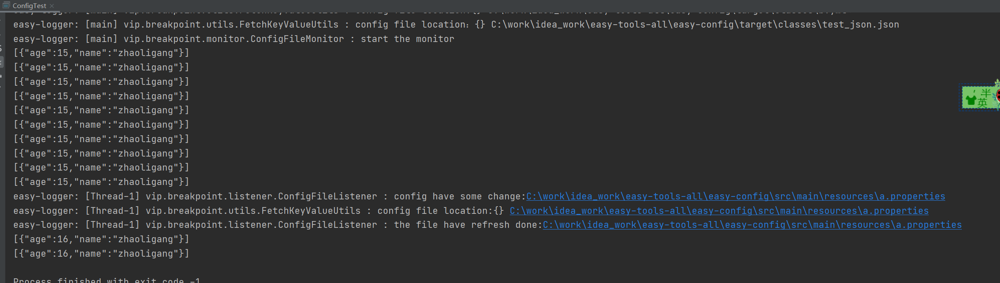

## 一、动态配置基础：easy-config组件

### 1.1 背景

> 在简单的Java应用中，任何地方都需要参数配置。然而，应用并不是基于spring项目的，无法获取配置。为了解决这个问题，实现配置的简单化以及中心化，实现了这个项目。
>
> 本项目是基于`commons-io`工具实现的观察者模式文件动态监控配置的组件。

`commons-io`版本如下：

```xml
        <dependency>
            <groupId>commons-io</groupId>
            <artifactId>commons-io</artifactId>
            <version>2.8.0</version>
        </dependency>
```

### 1.2 核心功能

任何基于java的应用，都可以实现文件配置的动态更新。动态监听文件变化，及时更新应用中的配置项目。

## 二、组件的使用方法

### 2.1 引入组件坐标

```xml
<!-- https://mvnrepository.com/artifact/vip.breakpoint/easy-config -->
<dependency>
    <groupId>vip.breakpoint</groupId>
    <artifactId>easy-config</artifactId>
    <version>1.0.1</version>
</dependency>

```

在项目的pom.xml中，引入上面的坐标。

### 2.2 定义配置

?> 本项目提供了一系列的值提供器，例如：`BooleanValueSupplier`、`ByteValueSupplier`、`CharValueSupplier`、`DoubleValueSupplier`、`FloatValueSupplier`、`IntValueSupplier`、`ListValueSupplier`、`LongValueSupplier`、`MapValueSupplier`、`ObjectValueSupplier`、`ShortValueSupplier`、`StringValueSupplier` 以及 `ValueSupplier`。 其中 `ValueSupplier` 是所有提供器的父接口，用于高度的抽象接口的功能。接口的定义如下：

```java
/**
 * 值提供器
 *
 * @author : breakpoint
 * create on 2022/10/21
 * 欢迎关注公众号 《代码废柴》
 */
public interface ValueSupplier<T, C> extends EasySupplier<T> {

    // 是否是不变的量
    default boolean isStatic() {
        return false;
    }

    // 值的 key
    String valueKey();

    // 获取默认的方法
    T getDefaultValue();

    // 值的类型
    Class<C> valueClass();

}
```

!> 想使用本配置，需要完成一下配置，这里使用`StringValueSupplier`为例，阐述如何使用这个配置。

* 第一步：定义一个enum枚举类实现`StringValueSupplier`提供器，例子如下：

```java
/**
 * @author : breakpoint
 * create on 2022/10/23
 * 欢迎关注公众号 《代码废柴》
 */
public enum StringConfigEnum implements StringValueSupplier {
    TEST("test", "默認值", "测试"),
    ;

    private final String valueKey;
    private final String defaultValue;
    private final String desc;

    StringConfigEnum(String valueKey, String defaultValue, String desc) {
        this.valueKey = valueKey;
        this.defaultValue = defaultValue;
        this.desc = desc;
    }

    @Override
    public String valueKey() {
        return this.valueKey;
    }

    @Override
    public String getDefaultValue() {
        return this.defaultValue;
    }
}

```

* 第二步：在项目的路径下创建`test.properties`，内容如下：

```properties
test=[{"age":15,"name":"zhaoligang"}]
```

> 上面的代码中，`valueKey`表示配置值的key，`defaultValue`配置的默认值，当配置文件中配置值不存在的时候，使用这个默认值。`desc`值描述。

### 2.3 获取值并使用

在需要读取配置文件的地方，直接使用枚举类获取，实例代码如下：

```java
/**
 * @author : breakpoint
 * create on 2022/10/23
 * 欢迎关注公众号 《代码废柴》
 */
public class ConfigTest {

    public static void main(String[] args) throws Exception {
        while (true) {
            String integer = StringConfigEnum.TEST.get();
            System.out.println(integer);
            Thread.sleep(3000);
        }
    }
}
```

`String integer = StringConfigEnum.TEST.get();`就可以获取配置值，如果想修改配置值，不需要重新启动项目，直接修改配置文件的内容即可！下面是一个演示案例。



## 三、项目外文件地址配置

!> 为了考虑项目编写成功后，打成 `jar` 包后，配置文件无法读取了，也无法修改配置文件了，此时需要在项目外面某一个文件夹配置项目的信息。这个部分就是解决这个问题的。

如果想读取已知目标路径的配置，可以采用下面的方式进行启动项目：

```shell
# configFilePath 配置文件的路径 可以使用逗号`,`分割，配置多个文件夹
java -jar xxx.jar -DconfigFilePath=C:\work\idea_work,XXX,XXXX,XXX
```


## 四、联系方式

🐘

<table>
  <tr>
    <td align="center">
      <a href="#">
        
      </a>
      <br />
      <span>微信</span>
    </td>
    <td align="center">
      <a href="#">
        
      </a>
      <br />
      <span>微信公众号</span>
    </td>
  </tr>
</table>

>  以上就是 `easy-config` 组件的全部功能，由于作者水平有限，肯定会存在需要歧义的地方，如果你有任何的疑问，都可以联系本作者。同时也欢迎关注《代码废柴》公众号。

**{docsify-updated}** 

